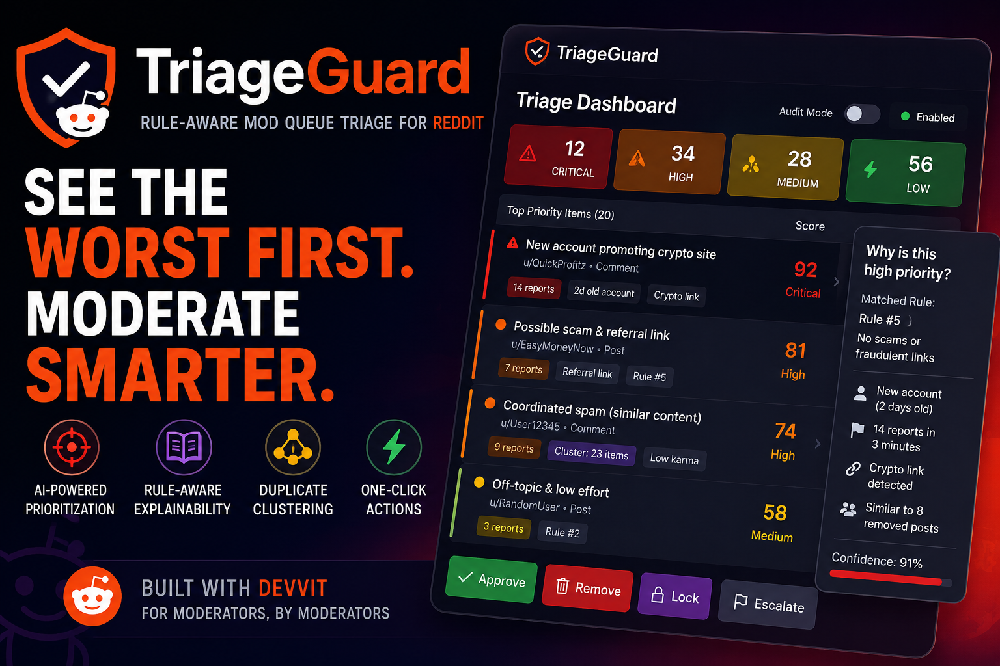

# TriageGuard



**Queue intelligence for moderators** — a [Devvit](https://developers.reddit.com/docs) mod tool that turns chaotic reports into a **prioritized, rule-aware moderation workflow** with explainable reasoning and one-click actions.

> TriageGuard helps moderators focus on the most dangerous content first by turning chaotic reports into a prioritized, rule-aware moderation workflow with explainable reasoning and one-click actions.

## Hackathon

Built for the [Reddit Mod Tools and Migrated Apps Hackathon](https://mod-tools-migration.devpost.com/) (category: **Best New Mod Tool**).

## Features (MVP)

- Ingests `PostReport`, `CommentReport`, `AutomoderatorFilterPost`, `AutomoderatorFilterComment`
- Heuristic urgency scoring (0–100) with risk bands: Critical / High / Routine / Likely OK
- **Explainability panel** — why prioritized, matched wiki rule, suggested action
- Wiki rules cache + optional Groq rule enrichment for Critical/High
- Custom post **Mod Triage Dashboard** (moderator-only)
- Menu actions: **Approve**, **Remove** (confirmation form), **Open Dashboard**
- `auditMode` on by default

## Quick start

### Prerequisites

- Node.js **≥ 22.2**
- Reddit account + [Devvit CLI](https://developers.reddit.com/docs) login
- Moderator access to a test subreddit (&lt; 200 subscribers for playtest)

### Install & playtest

```bash
cd triageguard
npm install
npm run login          # or: npx devvit login
npm run init           # register app on Reddit (once) — opens browser wizard
npm run dev            # first run uploads + creates playtest subreddit
npx devvit settings set llmApiKey    # optional — after first playtest/upload
```

Follow the playtest URL, install the app on your sub, then:

1. Open the pinned **TriageGuard — Mod Triage** post (or sub menu → **TriageGuard: Open Dashboard**)
2. Report a test post or comment
3. Refresh the dashboard — item appears with score and explain panel

### Tests

```bash
npm test
npm run typecheck
```

## Documentation

| Doc | Description |
|-----|-------------|
| [docs/ARCHITECTURE.md](docs/ARCHITECTURE.md) | System design & diagrams |
| [docs/IMPLEMENTATION.md](docs/IMPLEMENTATION.md) | Code map & flows |
| [docs/DEPLOYMENT.md](docs/DEPLOYMENT.md) | Upload, publish, settings |
| [docs/UI_UX.md](docs/UI_UX.md) | Dashboard UX, visual system, future React client |

## Project structure

```
triageguard/
├── assets/
│   └── Thumbnail.png    # Project thumbnail / Devpost hero
├── devvit.json          # App manifest (permissions, blocks entry)
├── src/
│   ├── main.tsx         # Triggers, settings, menus, custom post registration
│   ├── config/          # Scoring weights & constants
│   ├── services/        # Ingest, store, wiki, LLM
│   └── ui/              # Blocks dashboard (explain panel)
├── tests/               # Vitest (scoring)
└── docs/
```

## License

Hackathon submission — see Reddit Devvit terms for app distribution.
