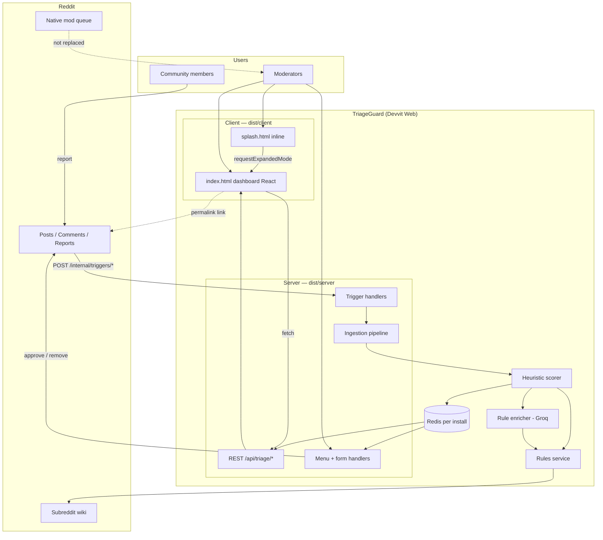
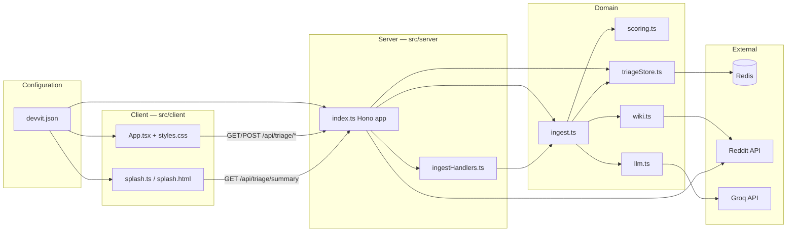
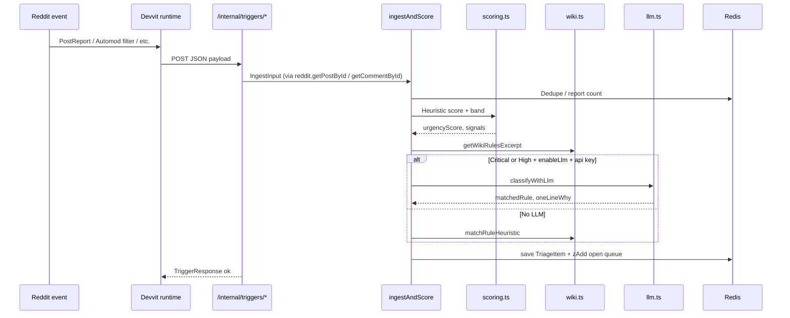
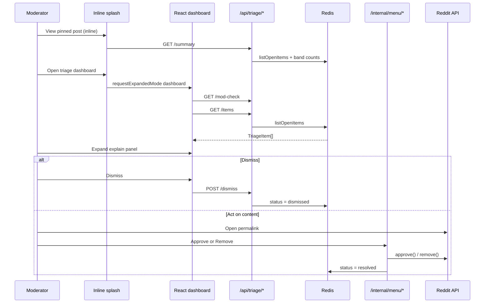
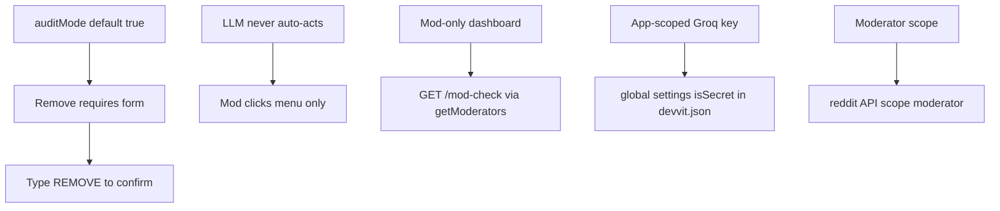
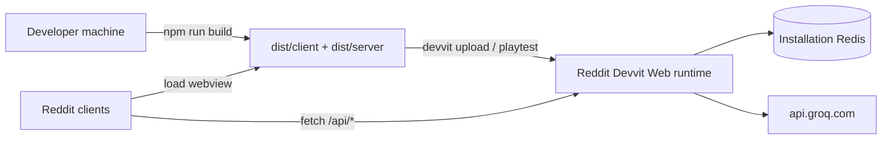

# TriageGuard — Architecture

TriageGuard is a **Devvit Web** mod tool: a React client for the dashboard UI, a Node server (Hono) for triggers, menus, and APIs, and shared TypeScript services for scoring and persistence. Configuration lives in [`devvit.json`](../devvit.json); there is **no Devvit Blocks** entry (`Devvit.addCustomPostType` was removed for App Review compliance).

## System context



**Constraint:** Devvit cannot reorder Reddit’s native mod queue. TriageGuard is a **parallel prioritized work list** with explainability.

## Platform stack

| Layer | Technology | Output |
|-------|------------|--------|
| Manifest | `devvit.json` | Triggers, menu, forms, settings, post entrypoints |
| Client | Vite + React 18 | `dist/client/` (`splash.html`, `index.html`) |
| Server | Vite SSR + Hono | `dist/server/index.cjs` |
| Domain | TypeScript services | Shared by server handlers |
| Runtime | Reddit Devvit Web (`@devvit/web` 0.13.x) | Hosted by Reddit |

Server build: `scripts/build-server.mjs` (esbuild + `externalizeDevvitProtos` from `@devvit/build-pack`). Do **not** put `@devvit/protos` in Vite `ssr.external` — that externalizes every `json/` / `types/` subpath and playtest fails with `MODULE_NOT_FOUND`. This app only imports proto subpaths, so the output is a self-contained ~3 MB `dist/server/index.cjs` that uses `globalThis.devvit.config` from the host for gRPC plugins.

Build: `npm run build` → `devvit upload` / playtest (see [DEPLOYMENT.md](./DEPLOYMENT.md)).

## View modes and entrypoints

| Entrypoint | File | Mode | Purpose |
|------------|------|------|---------|
| `default` | `splash.html` | Inline (`height: regular`) | Band-count summary + **Open triage dashboard** |
| `dashboard` | `index.html` | Expanded (`height: tall`) | Full React triage UI |

On install, the server creates a pinned post via `reddit.submitCustomPost({ entry: 'default' })`. Mods expand to `dashboard` with `requestExpandedMode(event, 'dashboard')` from the splash client.

## Component architecture



| Component | Location | Responsibility |
|-----------|----------|----------------|
| **Manifest** | `devvit.json` | Post entrypoints, triggers, menu, forms, settings, permissions |
| **Server router** | `src/server/index.ts` | Hono routes: triggers, menu, forms, public API |
| **Trigger ingest** | `src/server/ingestHandlers.ts` | Map event payloads → `ingestAndScore` |
| **Inline client** | `src/client/splash.*` | Summary + expand to dashboard |
| **Dashboard client** | `src/client/App.tsx` | Bands, filters, explain panel, dismiss |
| **Ingestion** | `src/services/ingest.ts` | Orchestrate score + enrich + persist |
| **Scoring** | `src/config/scoring.ts` | Pure heuristic engine (Vitest) |
| **Triage store** | `src/services/triageStore.ts` | Redis CRUD, sorted open queue |
| **Wiki** | `src/services/wiki.ts` | Fetch/cache rules, heuristic rule match |
| **LLM** | `src/services/llm.ts` | Groq classify + rate limit + cache |

## Server endpoints

### Triggers (`devvit.json` → POST `/internal/...`)

| Trigger | Handler | Action |
|---------|---------|--------|
| `onAppInstall` | `/internal/triggers/app-install` | Init Redis, cache wiki, `submitCustomPost`, store dashboard post id |
| `onPostReport` | `/internal/triggers/post-report` | Ingest post report |
| `onCommentReport` | `/internal/triggers/comment-report` | Ingest comment report |
| `onAutomoderatorFilterPost` | `/internal/triggers/automod-filter-post` | Ingest automod post |
| `onAutomoderatorFilterComment` | `/internal/triggers/automod-filter-comment` | Ingest automod comment |

### Menu and forms

| Action | Endpoint | Response |
|--------|----------|----------|
| Open dashboard | `/internal/menu/open-dashboard` | `navigateTo` dashboard post URL |
| Approve | `/internal/menu/approve` | Reddit `approve()` + resolve in Redis |
| Remove (prompt) | `/internal/menu/remove` | `showForm` → `removeConfirm` |
| Remove (submit) | `/internal/form/remove-submit` | Confirm `REMOVE`, `remove()`, resolve |

### Client API (fetched from webview)

| Method | Path | Purpose |
|--------|------|---------|
| GET | `/api/triage/summary` | Inline splash band counts + mod gate |
| GET | `/api/triage/mod-check` | Moderator verification for dashboard |
| GET | `/api/triage/items` | Open triage queue (top 20) |
| POST | `/api/triage/dismiss` | Dismiss item from triage list |

---

## Data flow — ingest path



## Data flow — moderator path



---

## Redis schema

| Key | Type | Purpose |
|-----|------|---------|
| `tg:schema_version` | string | Migration version |
| `tg:dashboard_post_id` | string | Pinned dashboard post |
| `tg:open` | sorted set | Item IDs by urgency score |
| `tg:item:{id}` | string (JSON) | Full `TriageItem` |
| `tg:thing:{thingId}` | string | thingId → item id |
| `tg:reportcount:{thingId}` | string | Report counter |
| `tg:wiki:rules` | string | Cached wiki excerpt |
| `tg:wiki:fetched_at` | string | Wiki cache timestamp |
| `tg:llm:{thingId}` | string | Cached LLM JSON |
| `tg:llm:hour_count` / `tg:llm:hour_bucket` | string | LLM rate limit |
| `tg:author:{user}` | hash | Repeat offender stats |

## Project layout

```
triageguard/
├── devvit.json              # Triggers, menu, settings, post entrypoints
├── vite.client.config.ts    # → dist/client
├── scripts/build-server.mjs # esbuild → dist/server/index.cjs
├── src/
│   ├── client/              # React dashboard + inline splash
│   ├── server/              # Hono app (triggers, API, menus)
│   ├── services/            # ingest, store, wiki, llm
│   ├── config/              # scoring, constants
│   └── types.ts
├── dist/                    # Built assets (gitignored)
├── tests/                   # Vitest (scoring)
└── docs/
```

---

## Security & trust



- **Approve / Remove** run only from mod menu handlers (`forUserType: moderator` in `devvit.json`).
- **Dismiss** only clears triage state in Redis; it does not remove content on Reddit.
- **LLM** is optional enrichment; heuristics + wiki rule matching work without it.

---

## Deployment topology



All app compute and Redis are **hosted by Reddit**. The only external dependency is **Groq** (optional, allowlisted in `permissions.http.domains`).

## Related docs

- [IMPLEMENTATION.md](./IMPLEMENTATION.md) — Code map and flows
- [DEPLOYMENT.md](./DEPLOYMENT.md) — Build, upload, settings
- [UI_UX.md](./UI_UX.md) — Visual system and explain panel
- [Devvit Web configuration](https://developers.reddit.com/docs/capabilities/devvit-web/devvit_web_configuration)
