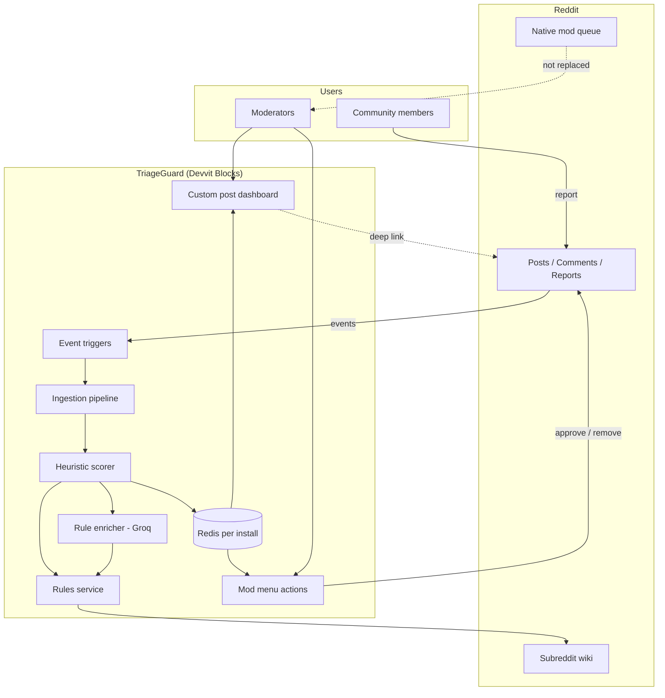
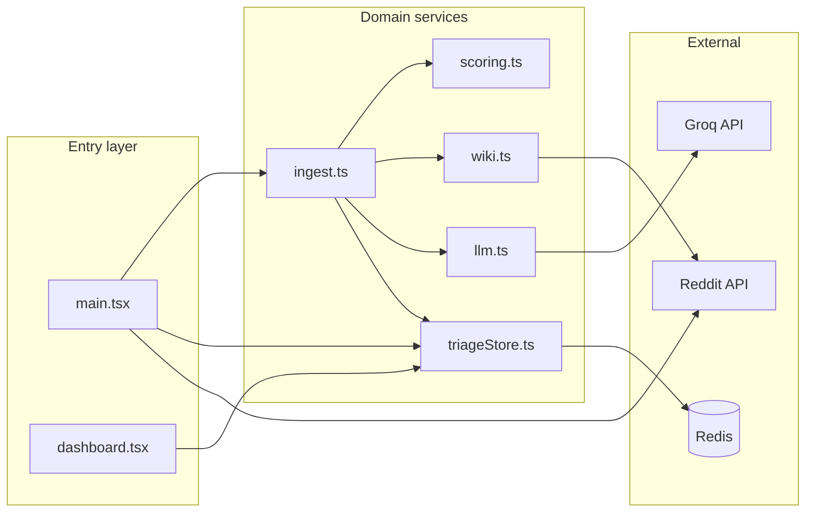
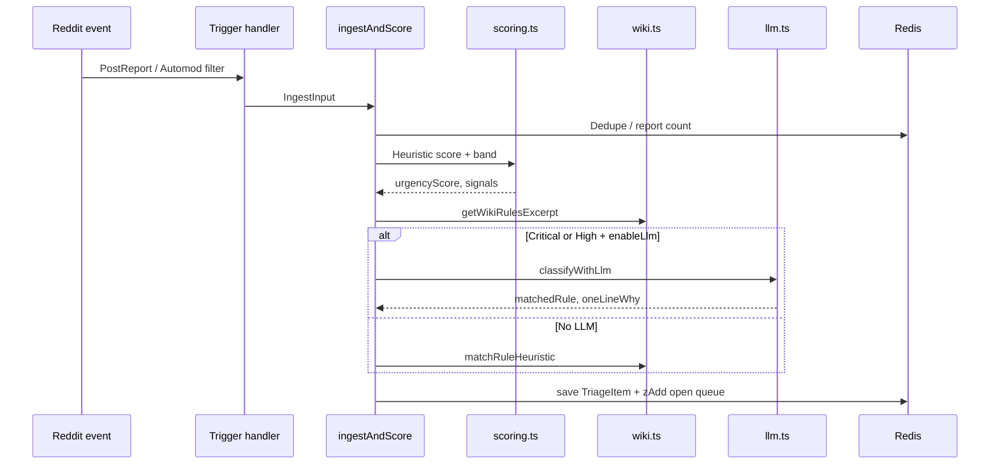
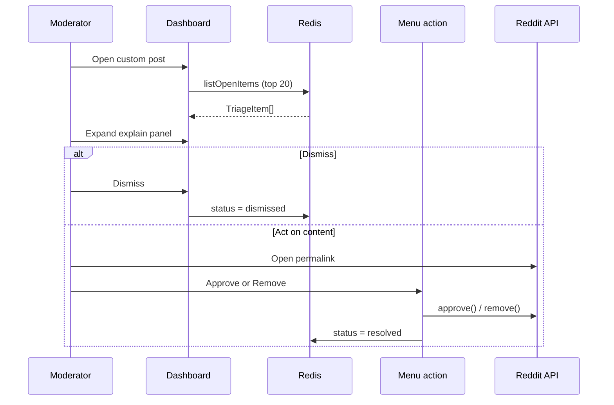
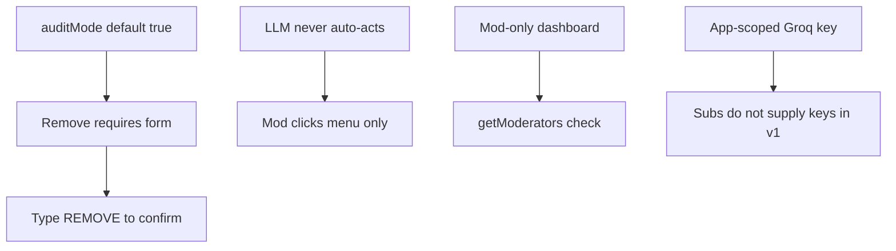
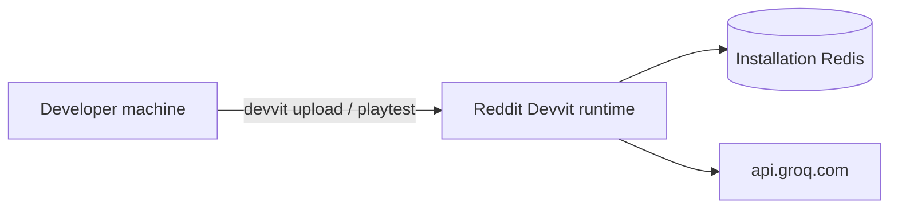

# TriageGuard — Architecture

## System context

**Constraint:** Devvit cannot reorder Reddit’s native mod queue. TriageGuard is a **parallel prioritized work list** with explainability.

## Component architecture

| Component | File | Responsibility |
|-----------|------|----------------|
| **Entry** | `src/main.tsx` | Triggers, settings, menus, custom post type |
| **Dashboard UI** | `src/ui/dashboard.tsx` | Blocks JSX — bands, filters, explain panel |
| **Ingestion** | `src/services/ingest.ts` | Orchestrate score + enrich + persist |
| **Scoring** | `src/config/scoring.ts` | Pure heuristic engine (testable) |
| **Triage store** | `src/services/triageStore.ts` | Redis CRUD, sorted open queue |
| **Wiki** | `src/services/wiki.ts` | Fetch/cache rules, heuristic rule match |
| **LLM** | `src/services/llm.ts` | Groq classify + rate limit + cache |

---

## Data flow — ingest path

## Data flow — moderator path

## Redis schema

| Key | Type | Purpose |
|-----|------|---------|
| `tg:schema_version` | string | Migration version |
| `tg:dashboard_post_id` | string | Pinned dashboard post |
| `tg:open` | sorted set | Item IDs by urgency score |
| `tg:item:{id}` | string (JSON) | Full `TriageItem` |
| `tg:thing:{thingId}` | string | thingId → item id |
| `tg:reportcount:{thingId}` | string | Report counter |
| `tg:wiki:rules` | string | Cached wiki excerpt |
| `tg:llm:{thingId}` | string | Cached LLM JSON |
| `tg:author:{user}` | hash | Repeat offender stats |

## Security & trust

## Deployment topology

All compute is **hosted by Reddit** — no external database or servers required for MVP.