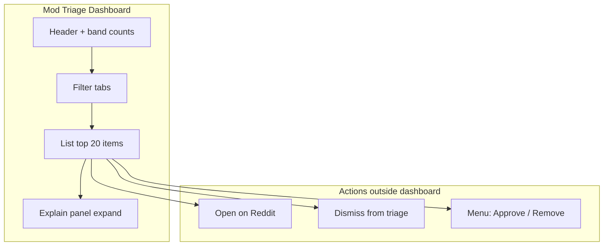
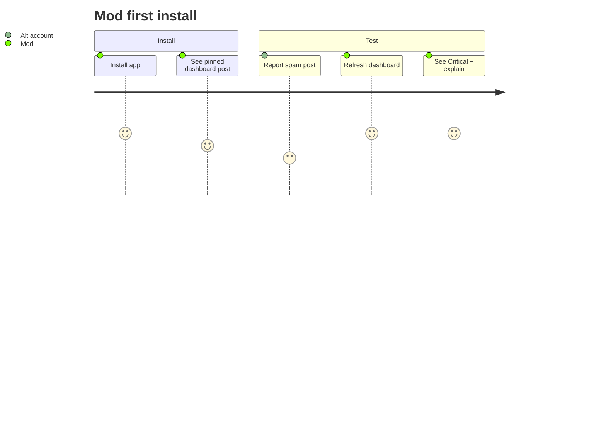
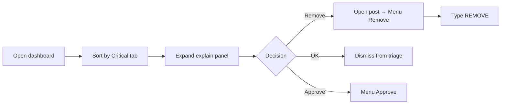

# TriageGuard — UI/UX Design

## Design principles

1. **Scannable in 5 seconds** — mods decide what to open first without reading paragraphs.  
2. **Explain before action** — every Critical/High row shows *why* collapsed; expand for full panel.  
3. **Trust by default** — audit mode, suggested action labels (not auto-execute), destructive actions confirmed.  
4. **Not “AI slop”** — brand as **queue intelligence**, not generic AI moderation.


## Information architecture




## Visual system

### Color tokens

| Token | Hex | Usage |
|-------|-----|--------|
| `bg.page` | `#0f0f1a` | Dashboard background |
| `bg.card` | `#16213e` | Triage row card |
| `bg.panel` | `#1a1a2e` | Explain panel |
| `text.primary` | `#FFFFFF` | Titles |
| `text.secondary` | `#AAAAAA` | Metadata |
| `text.muted` | `#888888` | Hints |
| `accent.brand` | `#4ECDC4` | Tagline, rule header |
| `accent.warn` | `#FFD93D` | Suggested action |
| `band.critical` | `#FF6B6B` | 🔴 Critical |
| `band.high` | `#FFA94D` | 🟠 High |
| `band.routine` | `#FFD93D` | 🟡 Routine |
| `band.ok` | `#6BCB77` | 🟢 Likely OK |

### Typography (Blocks)

| Element | Size | Weight |
|---------|------|--------|
| Page title | xlarge | bold |
| Band + score | medium | bold |
| Row title | medium | bold |
| Body / signals | small | regular |
| Hints | xsmall | regular |


## Explain panel (hero UI — Appendix C)

Target layout implemented in `src/ui/dashboard.tsx`:

```
┌─────────────────────────────────────────────────────────┐
│  🔴 CRITICAL                          Confidence: 91%   │
│  Score: 87/100  ·  u/user  ·  post  ·  3m ago           │
├─────────────────────────────────────────────────────────┤
│  Why prioritized:                                       │
│    • New account (< 1 day old)                          │
│    • 14 reports in 3 minutes                            │
│    • Blocked/suspicious domain: bit.ly                    │
├─────────────────────────────────────────────────────────┤
│  Matched rule:                                          │
│    "No scams or fraudulent links"                       │
│    (from r/yoursub wiki)                                │
├─────────────────────────────────────────────────────────┤
│  Suggested action: Likely remove (mod confirms)         │
├─────────────────────────────────────────────────────────┤
│  [ Show explain ] [ Open on Reddit ] [ Dismiss ]        │
│  Approve / Remove: ⋮ menu → TriageGuard               │
└─────────────────────────────────────────────────────────┘
```

**Devpost hero screenshot:** capture expanded explain panel on a Critical scam item.


## User flows

### Flow 1 — First install



### Flow 2 — Triage and act




## Component states

| State | UI treatment |
|-------|----------------|
| Loading | Centered “Loading triage queue…” |
| Empty | Checklist: heuristics, wiki, optional LLM key |
| Non-mod | “Moderators only” full-page message |
| LLM pending | Heuristic explain still complete |
| LLM failed | “Rule matched via heuristics” note in panel |


## MVP vs target UI (Devvit Web + React)

Current MVP uses **Devvit Blocks** for native Reddit rendering. Target v2 uses **Devvit Web** custom post with React for:

| Enhancement | Benefit |
|-------------|---------|
| CSS Grid layout | Denser list, sticky header |
| Animated band badges | Faster visual scan |
| Keyboard shortcuts | `j/k` navigate, `a` approve |
| Split pane | List + fixed explain sidebar |
| Toast stack | Action feedback |

### Target React layout (wireframe)

```
┌──────────────────────────────────────────────────────────────────┐
│ TriageGuard          🔴4  🟠12  🟡8  🟢2     [Refresh] [Settings]│
│ [All] [Critical] [High] [Routine] [Likely OK]                    │
├────────────────────────────┬─────────────────────────────────────┤
│ ▶ 🔴 87  crypto scam link  │  EXPLAIN                            │
│   u/newuser · 14 reports   │  Why prioritized:                   │
│                            │   • New account                     │
│ ▶ 🟠 62  off-topic promo     │   • Crypto domain                   │
│                            │  Matched rule:                      │
│ ▶ 🟡 41  mild keyword      │   "No scams..."                     │
│                            │  [Open] [Approve] [Remove]          │
└────────────────────────────┴─────────────────────────────────────┘
```

Migration path: see [ARCHITECTURE.md](./ARCHITECTURE.md) — add `post.entrypoints` + Vite React client; keep `src/services/*` on server routes.


## Accessibility notes

- Band uses **emoji + text** (not color alone): 🔴 CRITICAL  
- One-line why visible on row before expand (SRS NFR-4.2)  
- Confirmation form requires typing `REMOVE` (audit mode)  
- Contrast: light text on dark cards (#FFFFFF on #16213e)


## Copy guidelines

| Use | Avoid |
|-----|-------|
| Queue intelligence | AI moderation |
| Rule-aware triage | GPT-powered |
| Suggested action | Auto-remove |
| Why prioritized | Risk score |

Primary sentence (Devpost):

> TriageGuard helps moderators focus on the most dangerous content first by turning chaotic reports into a prioritized, rule-aware moderation workflow with explainable reasoning and one-click actions.
